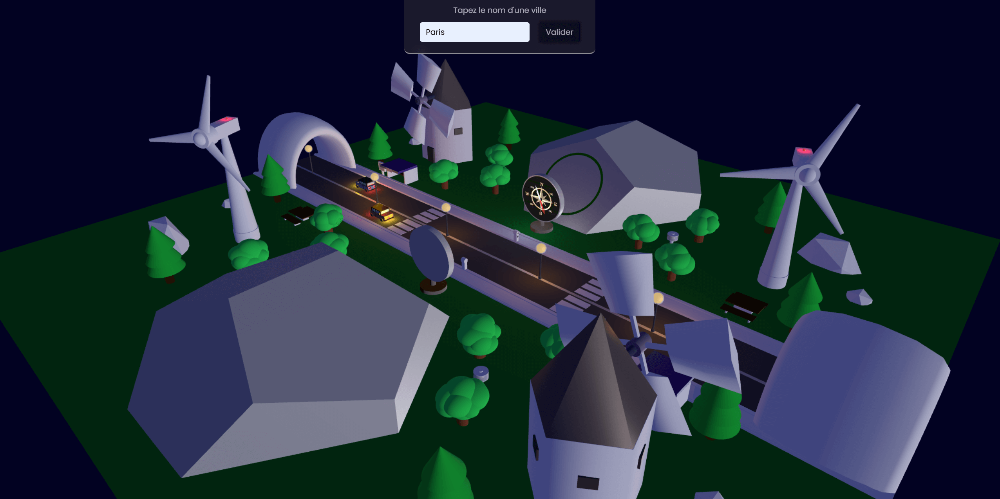

# MISTRAL GAGNANT

## Description

**Mistral Gagnant** provides real-time information on wind speed and direction, making it an ideal tool for weather enthusiasts and those planning outdoor activities. The application is powered by live data and offers a visually appealing 3D visualization of wind patterns using the Three.js library.



## Challenge

The development of **Mistral Gagnant** focused on leveraging the Three.js library to explore advanced 3D visualizations. Completed in just one week, the project successfully tackled the integration of real-time data into a dynamic 3D environment. Key development activities included creating interactive 3D scenes, and manipulating objects and groups within those scenes to reflect live wind patterns effectively.

## My process

### Built with

- Vanilla JavaScript
- Three.js

### Key Features

- **Real-Time Data:** Utilizes APIs to fetch real-time wind speeds and directions.
- **3D Visualization:** Implements Three.js to render wind patterns in a visually appealing 3D format.

## Getting Started

To get a local copy up and running follow these simple steps:

1. Clone the repo

   ```bash
   git clone https://github.com/ABBA-74/app-three-js.git
   cd app-three-js
   ```
